# MOMS WELLBEING CLUB

## Introduction

Moms Wellbeing Club website is a landing page for moms in Enniscorthy, St Mary's Primary School, who want to take a break from the day-to-day routine and get social. Joining the Club, they can enjoy relaxing and interesting activities, such us Yoga, Aerobics, Art and Crafts, reading books and discussing them together. In addition, they can bring their toddlers to the Toddler Group, where moms can enjoy a cup of coffee or tea, socializing with other moms, while toddlers play together and get involved in different activities. 
Visiting this website, users will be able to find all the information about the Club, all the activities they could join, schedule for each activity. There is the possibility to book a place for activities by submitting a sign up form. There is also a Gallery with Club’s activities photos and contact information.
The site is targeted towards moms whose children are St Mary's Primary School students. View the live site [here.](https://t1i2n3a4.github.io/moms-wellbeing-club/)

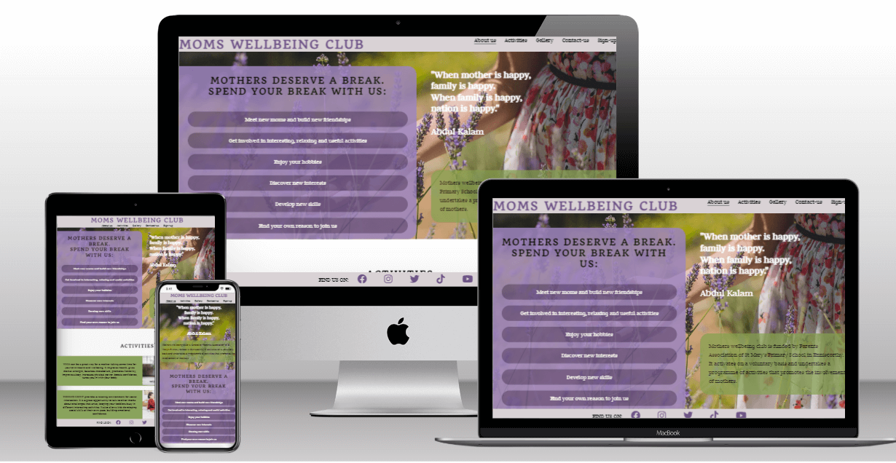

## User Experience (UX)

### Target audience

The target audience for this website are:
* St Mary's Primary School moms who are interested in one or more of the Club's activities, such as: Yoga, Aerobics, Reading, Toddler Group, Art and Crafts.
* St Mary's Primary School moms, members of Parents' Association.
* St Mary's Primary School moms who are interested to join the Club.
* St Mary's Primary School moms who are already members of the Club.

### User stories

#### Website Owner

As a website Owner, I intend to:

* provide the users with clear and easy to read information about the Club;
* provide the users with the information about the activities and the schedules;
* offer to the user the possibility to contact the Club;
* offer to the user the possibility to sign-up and join the Club for one or more activities;
* ensure the access to Club's Social Media Networks;
* ensure the user with a good visual experience when using the website;
* make the website accessible and easy to navigate.

#### First Time Visitors

As a first time visitor, I expect to:

* easily understand the main purpose of the site and learn more about the Club;
* easily find the activities purposed for joining.
* easily and intuitively navigate throughout the site to find content;
* access the menu from any part of the page;
* be able to view the website and read all information on all screen sizes;
* see a visually appealing design.

#### Returning Visitors

As a returning visitor, I expect to:

* find information about the activities;
* find the schedules for the activities;
* find the Club's contact details;
* find Club's social media links;
* easily sign-up and join the Club.

#### Frequent Users

As a frequent visitor, I expect to:

* easily access the Gallery;
* easily join one or more activities.

## Features

### Header

* The header contains website’s Logo and the Navigation Menu, with links to the About-us Activities, Gallery, Contact us and Sign up pages, which are responsive on all devices.
* The Header has fixed position to allow users to easily access different pages within the site on any size device.
* The links to pages have zoom effect when being mouse hovered and the link to the active page is underlined to show the user which page he accessed at that moment.


### About-us 

* About-us page contains a quote, the club’s ethos and provides the user with information about the purpose of the club and it’s foundation, all of them on a background picture, that makes the site visually appealing. The page is responsive for any device screen.


* It also contains the Activities section, which can be accessed as a separate page from the navigation menu. The activities page contains 5 sections, one for each activity type. Each section consists of:
    * Activity description;
    * A picture for that activity, including a link to Sign-up page;
    * Activity schedule.
* This will allow the users to choose which activity they are going to join.


* Contact-us page is also a part of the About us page, however it can be accessed from the navigation bar. Contact us page comprises:
    * The address;
    * Get in touch information (phone and email);
    * A map.
* This will allow the users to easily find the contact details and get in touch with the club.


### Gallery page

* The gallery provides the users with photos from the club's activities.
* The page is fully responsive on all devices.


### Sign-up

* Sign-up page consists of a thank you heading and the suggestion to join the club.
* A submission form comprising 2 fieldsets and a submission button is also included on the page, all of them being fully responsive on any devices. 
* The first fieldset requires personal information as:
    * First name
    * Last name
    * Email address
* The second fieldset offers the users the possibility to check one or more activities to join.


### Footer

* The footer includes icons and links to social media networks.
* It ensures the users with an easy access to the social networks.
* The text: FIND US ON is hidden for smaller viewports to make the footer responsive.


### 404 Page

* A 404 page is implemented to display when the users navigate to a broken link.
* The 404 page contains an information that makes the user aware that the page he looks for couldn't be found.
* The 404 page also contains a link that allows the user to return to main website.

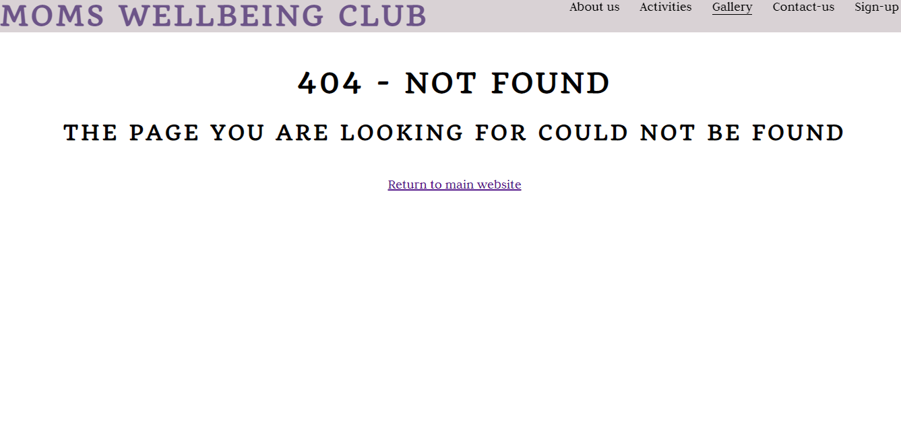

### Features left to implement

* Pictures filter to be added to gallery page, to sort them by activity type.
* A sign-up form for mothers who would like to become volunteers by introducing and organising new activities.


## Design

### Wireframes

* Website's wireframe was created in Balsamiq.
* Desktop and Mobile versions are presented below.

  
    * About us page
    
  
    * Activities section

    

    * Contact-us section

    

    * Gallery page

    

    * Sign-up page

    


### Color scheme

* The color scheme for the website was selected based on the purpose of the club to help mothers achieving a state of wellbeing.
* The color green represents new beginnings and growth. It contains calming attributes, but also incorporates energy.
* The color purple brings up a feeling of trust and reliability. It is also one of the mindfulness color.
* The background image of the landing page incorporates both colors: green and purple. The picture represents a woman in a lavender field, touching the lavender flowers. 
* Lavender flower is a symbol of purity, silence, devotion, serenity, grace and calmness, which also reveals the club's purpose.
* The nuances of green and purple for the website were extracted from the background picture using Adobe Color.

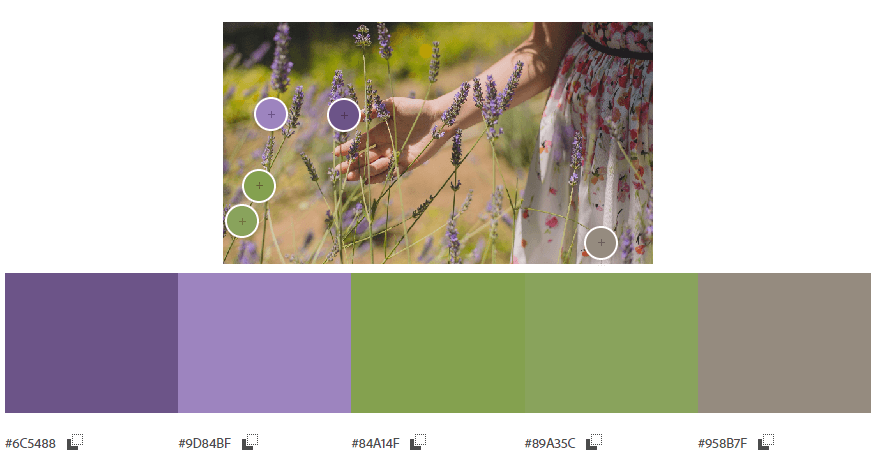


## Technologies

* HTML
    * The website's structure was developed using HTML as the main language.
* CSS
    * The website was styled using CSS.
* [GitHub](https://github.com/)
    * GitHub hosts the source code that is deployed using Git Pages.
* Git
    * Commit and pushing code, using Git while creating the website.
* [Font Awesome](https://fontawesome.com/)
    * The icons used as Social Media links on the Footer were obtained from Font Awesome website.
* [Google Fonts](https://fonts.google.com/)
    * Used to select font families for website's body and headings.
* [Tinypng](https://tinypng.com/)
    * Used to reduce the pictures embedded on the website.
* Paint app 
    * Used to tailor the pictures embedded on the website.
* [Adobe Color](https://color.adobe.com/)
    * Used to extract the color scheme from the background picture.
* [Balsamiq](https://balsamiq.com/wireframes/)
    * Used to create the wireframes for desktop, tablet and mobile.
* [Google maps](https://www.google.com/maps/)
    * Used to embed the map on Contact us section.


## Testing

### Validator Testing

* HTML 
    * [W3C Validator](https://validator.w3.org/) was used for HTML validation.
    * No errors or warnings have been found.

    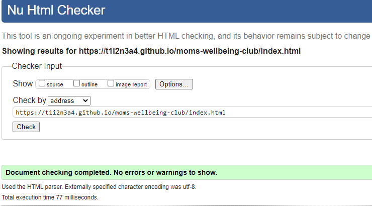

    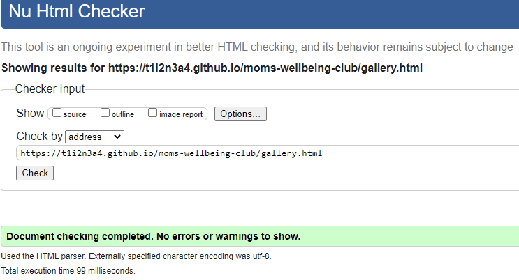

    

    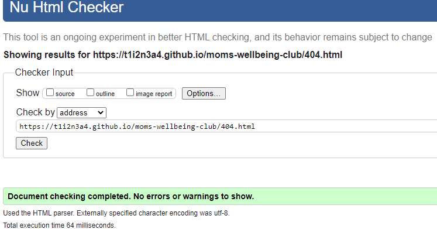
    


* CSS
    * [W3C CSS validator (Jigsaw)](https://jigsaw.w3.org/css-validator/) was used for CSS validation.
    * No errors have been found.

    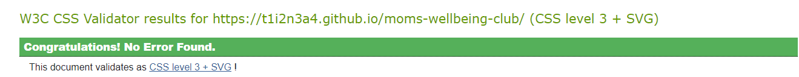

### Lighthouse Testing

* Performance, Accessibility, Best Practices and SEO for each page were tested by running them through Lighthouse in DevTools.
* The results for each page are presented below.

    * About-us page

    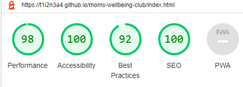

    * Gallery page

    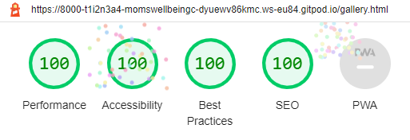

    * Sign-up page

    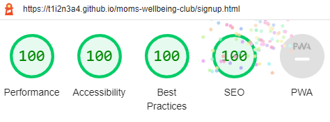

### Responsiveness

* All website's pages are responsive on any screen sizes from 320px and upwards on Chrome, Firefox, Edge and Opera browsers.
* The responsiveness was tested using Developer Tools set to responsive and decreasing width from maximum to 320px.
* The website was opened on the following devices and no issues were seen:
    * Samsung Galaxy S22
    * Iphone 12 Mini

### Accessibility

* Website's accessibility evaluation was done using [Wave Accessibility](https://wave.webaim.org/) tool.
* No errors have been found.
* Accessibility evaluation results are presented below.
    * About us page accessibility evaluation result:

    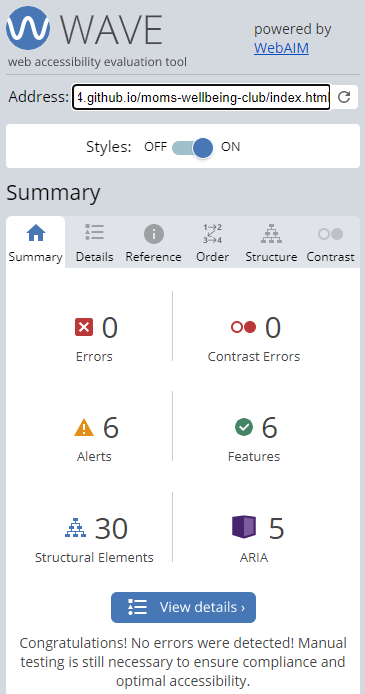

    * Gallery page accessibility evaluation result:

    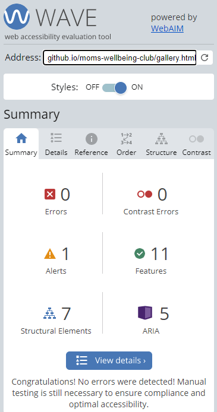

    * Sign-up page accessibility evaluation result:

    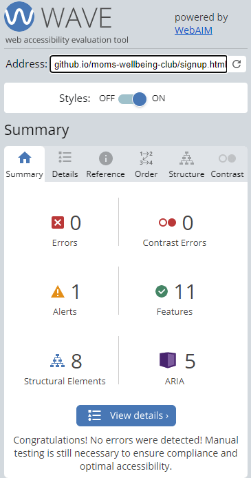

### Functional testing

* Navigation Links

    * Clicking on the navigation links, all the links lead to the respective pages.
    

* Social Media Links

    * Clicking on the Social Media icons, each of the links opens the respective Social Media Platform.
    * As the webpage is for a fictive Club, the links open the Social Media Platform, not the Club's page on that platform.
    * As expected, each of the Social Media Platform opens in a new tab.


* Form testing

    * The form on the Sign-up page was tested for functionality.
    * If one of the fields is empty a warning message "Please fill this field" appears when click to submit.
    * If the email field is submitted with a non-email text, a warning message "Please include an '@' in the email address" appears.
    * If correct inputs are submitted, no warning or errors appear. 
    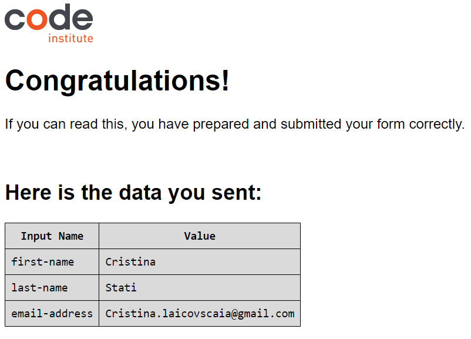


### Unfixed bugs


## Deployment

### Version Control

* The site was created on [Gitpod](https://www.gitpod.io/) platform.
* The code was added to the staging area using ```git add .``` command.
* Changes were committed using ```git commit -m “ ”``` command.
* Committed code was pushed to the GitHub repository using ```git push``` command.

### Deployment to Github Pages

* The website was deployed to GitHub Pages, following the steps:
    * GitHub Repository - Settings - General (left side menu) - Pages - Build a Deployment - Source - Branch: main - Save.
    * Go back to GitHub Pages were a live link is displayed when published successfully.
    * The live link can be found [here](https://t1i2n3a4.github.io/moms-wellbeing-club/).

## Credits

* Code
    * Most of the codes used throughout the project were taken from the [Code Institute Programme](https://learn.codeinstitute.net/), including the CI projects.
    * [W3Scools](https://www.w3schools.com/) and [freeCodeCamp](https://www.freecodecamp.org/) were used to solve the issues aroused while developing the project.
* Content 
    * The website's content was written by the developer.
    * Gareth's McGirr README was used as a sample for this project.
* Media
    * All the pictures for the website were taken from [Pexels](https://www.pexels.com/).
    * [Google Maps](https://www.google.com/maps/) was used for the map on the Contact us section.
    * [Code Institute Channel Lead Library](https://www.youtube.com/playlist?list=PL_7334VduOHvzZYlgy_0kZLcic2NINCUt) guided throughout the project development, especially on the planning stage.
    
* Acknowledgements
    * Special thanks of gratitude to my project mentor Daisy McGirr for her guidance at every stage of the project, continuous support, understanding, encouragement and supply with useful information .
    * Special thanks of gratitude to our cohort tutor Irene Neville for her continuous support, for informational material and for providing with all the facilities required during the project development.
    * Code Institute Team.
    * Thank you to my family for their understanding, patience, support and encouragement.
     


