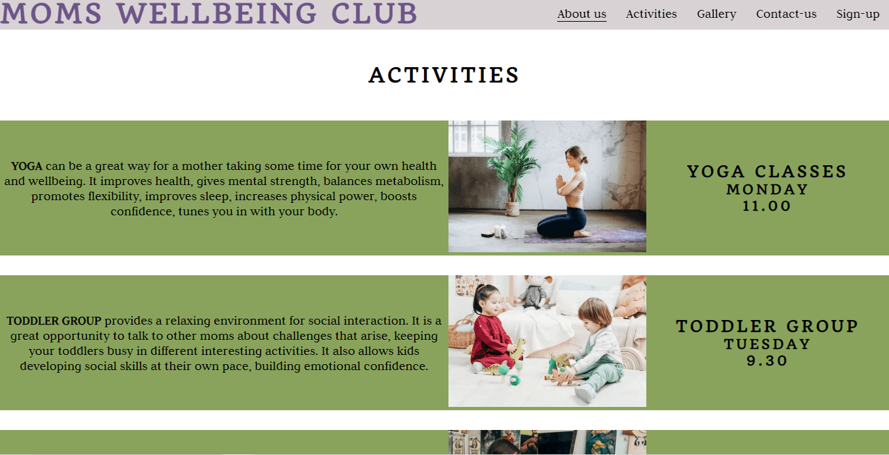
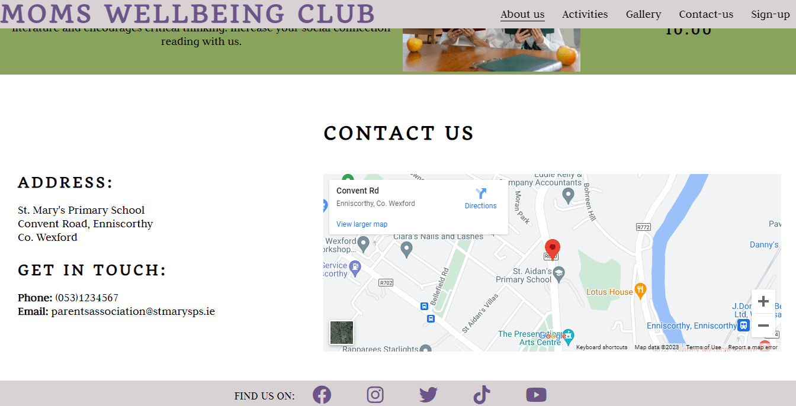
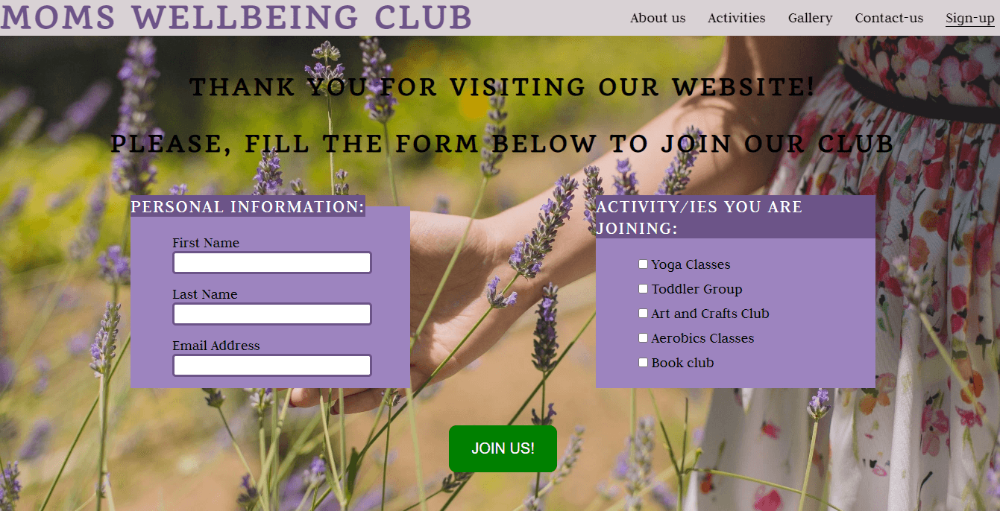

# MOMS WELLBEING CLUB

Moms Wellbeing Club website is a landing page for moms in Enniscorthy, St Aidans Primary School, who want to take a break from the day-to-day routine and get social. Joining the Club, they can enjoy relaxing and interesting activities, such us Yoga, Aerobics, Art and Crafts, reading books and discussing them together. In addition, they can bring their toddlers to the Toddler Group, where moms can enjoy a cup of coffee or tea, socializing with other moms, while toddlers play together and get involved in different activities. 
Visiting this website, users will be able to find all the information about the Club, all the activities they could join, schedule for each activity. There is the possibility to book a place for activities by submitting a sign up form. There is also a Gallery with Club’s activities photos and contact information.
The site is targeted towards moms whose children are St Aidans Primary School students. View the live site [here](http://)

## Features

### Header

* The header contains website’s Logo and the Navigation Menu, with links to the About-us Activities, Gallery, Contact us and Sign up pages, which are responsive on all devices.
* The Header has fixed position to allow users to easily access different pages within the site on any size device.
* The links to pages have zoom effect when being mouse hovered and the link to the active page is underlined to show the user which page he accessed at that moment.

### About-us 

* About-us page contains a quote, the club’s ethos and an aside information about the purpose of the club and it’s foundation, all of them on a background picture. The page is responsive for any device screen.

* It also contains the Activities section, which can be accessed as a separate page from the navigation menu. The activities page contains 5 sections, one for each activity type. Each section is consists of:
    * Activity description;
    * A picture for that activity;
    * Activity schedule.

* Contact-us page is also a part of the About us page, however it can be accessed from the navigation bar. Contact us page comprises:
    * The address;
    * Get in touch information (phone and email);
    * A map.

### Gallery page

* The gallery provides the users with photos from the club's activities.
* The page is fully responsive on all devices.

### Sign-up

* Sign-up page consists of a thank you heading and the suggestion to join the club.
* A submission form comprising 2 fieldsets and a submission button is also included on the page, all of them being fully responsive on any devices. 
* The first fieldset requires personal information as:
    * First name
    * Last name
    * Email address
* The second fieldset offers the users the possibility to check one or more activities to join.

### Footer

* The footer includes icons and links to social media networks.
* It is fixed positioned to ensure an easy and immediat access to the social networks.
* The text: FIND US ON is hidden for smaller viewports to make the footer responsive.

### Features left to implement

* Pictures filter to be added to gallery page, to sort them by activity type.
* A sign-up form for mothers who would like to become volunteers by introducing and organising new activities.

## Design

### Wireframes

* Website's wireframe was created in Balsamiq.
* Desktop and Mobile versions are presented below.

    * About us page

    

    * Activities section

    

    * Contact-us section

    

    * Gallery page

    

    * Sign-up page
    
    

### Color scheme

## Technologies

* HTML
    * The website's structure was developed using HTML as the main language.
* CSS
    * The website was style using CSS.
* GitHub
    * GitHub hosts the source code which is deployed using Git Pages.
* Git
    * Commit and pushing code using Git while creating the website.
* Font Awesome 
    * The icons used as Social Media links on the Footer were obtained from Font Awesome website.
* Google Fonts
    * Used to select font families for website's body and headings.
* Tinypng 
    * Used to reduce the pictures embeded on the website.
* Paint app 
    * Used to tailor the pictures embede on the website.
* Adobe Color
    * Used to extract the color scheme from the background picture.
* Balsamiq
    * Used to create the wireframes for descktop, tablet and mobile.

